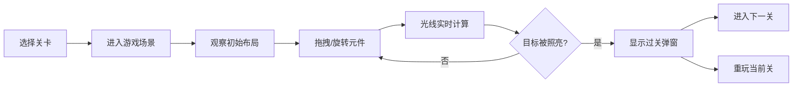

## 1. 产品概述

光线反射解谜游戏，玩家通过移动镜子和挡板，引导光线从光源照射到目标位置。利用光线直线传播、镜面反射和挡板遮挡的物理原理，通过最少的步数解开每个关卡。

- **核心玩法**：网格场景中放置固定光源和目标，玩家拖拽/旋转镜子改变光线路径，使光线照亮目标即过关。
- **目标用户**：休闲益智游戏爱好者，喜欢物理类解谜游戏的玩家。
- **产品价值**：锻炼逻辑思维和空间想象能力，提供轻松有趣的解谜体验。

## 2. 核心功能

### 2.1 用户角色

| 角色 | 注册方式 | 核心权限 |
|------|----------|----------|
| 玩家 | 无需注册，直接进入游戏 | 选择关卡、移动/旋转元件、查看步数、重开关卡 |

### 2.2 功能模块

1. **游戏主界面**：关卡选择、游戏说明、设置选项
2. **游戏场景**：网格渲染、光线传播、元件放置
3. **交互系统**：拖拽移动、旋转镜子、步数统计
4. **关卡系统**：多关卡设计、难度递进、过关判定
5. **视觉效果**：光线动画、目标照亮效果、过关动画

### 2.3 页面详情

| 页面名称 | 模块名称 | 功能描述 |
|----------|----------|----------|
| 游戏主界面 | 关卡列表 | 展示所有关卡，显示解锁状态和最佳步数 |
| 游戏场景 | 网格渲染 | 绘制游戏网格、光源、目标、镜子、挡板 |
| 游戏场景 | 光线系统 | 光线传播计算、镜面反射、碰撞检测 |
| 游戏场景 | 交互控制 | 拖拽移动元件、点击旋转镜子 |
| 游戏场景 | HUD界面 | 显示当前步数、重开按钮、返回按钮 |
| 过关弹窗 | 结果展示 | 显示过关步数、是否达到最佳步数、下一关按钮 |

## 3. 核心流程

玩家选择关卡 → 进入游戏场景 → 观察初始布局 → 拖拽/旋转镜子和挡板 → 光线实时计算并更新路径 → 目标被照亮 → 显示过关弹窗 → 进入下一关或重玩

## 4. 用户界面设计

### 4.1 设计风格

- **主色调**：深靛蓝 `#0f172a` 作为背景，营造科技感深色主题
- **强调色**：金色 `#fbbf24` 作为光线颜色，青蓝色 `#06b6d4` 作为镜子颜色，橙红色 `#f97316` 作为目标颜色
- **按钮风格**：圆角矩形按钮，带有柔和阴影，悬停时有缩放和发光效果
- **字体**：使用 Space Mono 等宽字体作为数字显示，搭配 Inter 作为正文
- **布局风格**：居中卡片式布局，游戏网格居中，顶部 HUD，底部控制区
- **图标风格**：使用 lucide-react 图标，线条简洁

### 4.2 页面设计概览

| 页面名称 | 模块名称 | UI 元素 |
|----------|----------|----------|
| 游戏主界面 | 关卡列表 | 网格卡片布局，每个卡片显示关卡编号、最佳步数、锁定状态，悬停有发光效果 |
| 游戏场景 | 网格渲染 | 深色背景网格，每个格子有细线边框，元件居中放置，光线以金色线条动态显示 |
| 游戏场景 | HUD 界面 | 顶部半透明条，左侧显示步数，右侧为重开和返回按钮 |
| 过关弹窗 | 结果展示 | 居中半透明黑色背景，白色文字，大字号显示"过关成功"，下方显示步数和按钮 |

### 4.3 响应式

- 桌面端优先设计，适配 1024px 及以上屏幕
- 移动端自适应缩放，保证游戏网格清晰可见
- 触摸操作优化，拖拽和点击都有良好的触摸反馈

### 4.4 视觉特效

- **光线效果**：金色发光线条，带有柔和的外发光和渐变
- **镜子效果**：青蓝色镜面，带有高光和反射质感
- **目标效果**：橙红色圆形，被照亮时有脉冲发光动画
- **过关动画**：光效从目标向四周扩散，伴随轻微缩放效果
- **拖拽效果**：被拖拽元件有半透明效果和跟随光标
