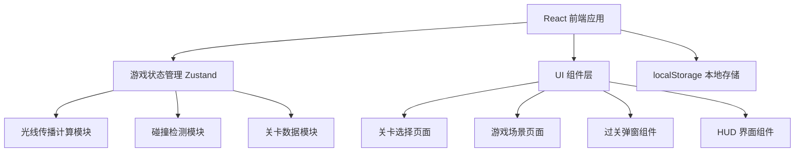

## 1. 架构设计



## 2. 技术描述

- **前端**：React@18 + TypeScript + Vite
- **样式**：TailwindCSS@3
- **状态管理**：Zustand
- **图标**：lucide-react
- **构建工具**：Vite
- **数据存储**：localStorage 存储关卡进度和最佳步数

## 3. 路由定义

| 路由 | 用途 |
|------|------|
| / | 关卡选择页面 |
| /game/:levelId | 游戏场景页面 |

## 4. 数据模型

### 4.1 关卡数据结构

```typescript
interface Position {
  x: number;
  y: number;
}

type ElementType = 'light' | 'target' | 'mirror' | 'blocker';
type Direction = 'up' | 'down' | 'left' | 'right';
type MirrorOrientation = '/' | '\\';

interface GameElement {
  id: string;
  type: ElementType;
  position: Position;
  direction?: Direction;      // 光源方向
  orientation?: MirrorOrientation; // 镜子朝向
  movable: boolean;            // 是否可移动
}

interface Level {
  id: number;
  name: string;
  gridSize: { width: number; height: number };
  elements: GameElement[];
  bestSteps?: number;
}

interface GameState {
  currentLevel: number;
  elements: GameElement[];
  steps: number;
  isComplete: boolean;
  lightPath: Position[];
}
```

### 4.2 光线传播算法

1. 从光源位置和方向开始
2. 沿方向逐格前进，记录路径
3. 遇到镜子：根据镜子朝向计算反射方向
4. 遇到挡板或边界：停止传播
5. 遇到目标：标记过关
6. 循环检测直到停止或过关

## 5. 目录结构

```
src/
├── components/
│   ├── GameBoard.tsx        # 游戏网格组件
│   ├── GameElement.tsx      # 游戏元件组件
│   ├── LightRay.tsx        # 光线渲染组件
│   ├── HUD.tsx            # 顶部信息栏
│   ├── LevelCard.tsx      # 关卡卡片
│   └── WinModal.tsx       # 过关弹窗
├── pages/
│   ├── Home.tsx           # 关卡选择页
│   └── Game.tsx           # 游戏场景页
├── store/
│   └── useGameStore.ts   # 游戏状态管理
├── utils/
│   ├── lightEngine.ts     # 光线传播计算
│   └── levels.ts        # 关卡数据
├── types/
│   └── game.ts          # 类型定义
├── App.tsx
├── main.tsx
└── index.css
```
